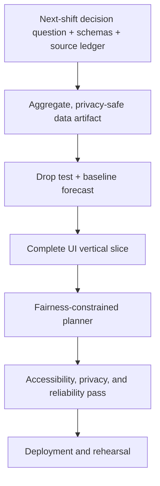

# Still Here SD Development Plan

> **Original design plan, retained for transparency.** The release evolved away
> from neighborhood displacement classification toward component-aligned
> fixed-panel evidence and a historical planning replay. See `README.md` and
> `docs/product/DEMO_SCRIPT.md` for current behavior.

## Objective

Turn a historical aggregate record into a forward-looking, decision-relevant recommendation. Deliver a reproducible, static web application that lets an outreach coordinator:

1. test whether an apparent neighborhood-level decline is supported, consistent with possible displacement, or too uncertain to classify;
2. inspect a backtested aggregate forecast with uncertainty; and
3. allocate a fixed outreach-hour budget with a visible minimum-coverage rule and human review.

The first release should optimize for one trustworthy, three-minute demo scenario rather than broad geographic or feature coverage.

## From record to decision

The historical series is an input, not the product. Each stage must answer a decision question and produce a typed output used by the next stage.

| Stage | Decision question | Output |
|---|---|---|
| Historical context | What changed, and can the periods be compared? | Validated neighborhood series with missingness and methodology flags |
| Evidence diagnosis | Does the apparent decline look sustained, displaced nearby, or unresolved? | Limited classification plus evidence for and against it |
| Forward outlook | What range of aggregate observations is plausible over the next planning horizon? | Backtested forecast, prediction interval, and model limitations |
| Planning translation | How should uncertainty affect preparation? | Relative planning load using the upper range and explicit continuity/uncertainty reserves |
| Resource decision | Given the available hours, what coverage is feasible for the next shift? | Fairness-constrained allocation, uncovered load, and infeasibility warnings |
| Human review | What should the coordinator accept, change, or revisit? | Explainable recommendation with locks, overrides, assumptions, and review triggers |

The primary product output is a **next-shift decision brief**, not a historical dashboard. It must state:

- what changed and how reliable that observation is;
- what the near-term range could be, including the planning horizon;
- where continuity of outreach may be at risk;
- how the available hours are recommended to be distributed;
- which constraints or assumptions drove the recommendation; and
- what new evidence or operational change should trigger reconsideration.

Uncertainty must propagate forward. Missing or incomparable history weakens the evidence classification, widens or suppresses the forecast, increases the visible reserve where justified, and may cause the planner to declare that no responsible recommendation can be made. The system must never turn weak evidence into precise-looking hours without showing that limitation.

## Delivery principles

- Work only with aggregate place-level observations; never publish precise coordinates or person-level records.
- Prefer simple, inspectable methods. A seasonal-naive forecast or adjacency comparison is an acceptable final method when it performs as well as more complex alternatives.
- Treat missingness, collection changes, and uncertainty as product data, not footnotes.
- Keep the demo independent of live APIs: Python produces versioned JSON artifacts consumed by a static React application.
- Do not let 311 complaint volume determine forecast demand or outreach allocation.
- Freeze optional features once the complete decision path is stable.

## Target architecture

```text
stillhere/
├── app/                     React, Vite, and TypeScript UI
├── pipeline/                Python ingestion, validation, analysis, and export
├── data/
│   ├── raw/                 immutable source files; never deployed
│   ├── processed/           normalized aggregate tables
│   └── cards/               source, quality, and model metadata
├── public/generated/        deployment-safe aggregate JSON
├── tests/                   Python and UI test suites
└── scripts/                 reproducible build and privacy checks
```

The pipeline-to-UI boundary should be a small set of versioned, schema-validated JSON files. The browser should handle scenario inputs and deterministic allocation recomputation, but not data cleaning or model fitting.

## Milestones

### M0 — Project foundation

**Goal:** Establish a runnable skeleton and lock the contracts needed by the vertical slice.

Work:

- Initialize the React/Vite/TypeScript application and Python pipeline environment.
- Add formatting, linting, type checking, and test commands with one top-level verification command.
- Create directories for raw, processed, card, and generated artifacts.
- Define schemas for observations, data-quality flags, drop-test evidence, forecasts, and planner inputs.
- Add a source ledger containing source URL, retrieval time, license/terms note, collection method, intended use, and known limitations.
- Add a generated-artifact manifest with schema version, build time, and input checksums.

Done when:

- A fresh checkout can install dependencies, run tests, build the static app, and render a placeholder scenario.
- Invalid fixtures fail schema validation in both Python and TypeScript.
- The generated output directory is clearly separated from raw data.

### M1 — Reproducible, privacy-safe data preparation

**Goal:** Produce a trustworthy aggregate history with the decision context required for diagnosis and forecasting.

Work:

- Acquire the preferred SDHEART source; use the documented SDRDL package if it is unavailable or too slow to integrate.
- Preserve the original files and record provenance without committing restricted or unnecessarily precise data.
- Normalize dates and neighborhood names while retaining original values and transformation notes.
- Detect duplicates, negative counts, missing months, inconsistent totals, and the post-March-2017 occupancy-multiplier comparability break.
- Aggregate precise observations to the minimum neighborhood/time grain used by the product.
- Produce a machine-readable quality report and deployment-safe observation artifact.
- Attach a planning horizon, geographic adjacency version, and comparability status so downstream analysis cannot silently invent them.
- Add a deny-list privacy test for latitude, longitude, addresses, record identifiers, and other precise-location fields.

Done when:

- One command deterministically rebuilds processed and generated data from the recorded inputs.
- Every published metric has source and retrieval metadata.
- Missing periods and methodology breaks remain explicit in the output.
- The prepared history is sufficient to answer a documented next-shift question, or is explicitly marked insufficient.
- Privacy tests prove that deployed artifacts contain no precise-location fields.

### M2 — Analytical vertical slice

**Goal:** Generate defensible drop-test and forecast results for one scenario before investing in visual polish.

Work:

- Implement sustained-change checks over a documented comparison window.
- Calculate selected-neighborhood and adjacent-neighborhood deltas with unmatched change allowed.
- Add source-agreement, completeness, and comparability evidence components.
- Implement deterministic classification rules for `likely_improvement`, `possible_displacement`, and `insufficient_evidence`.
- Store reasons for and against the result; avoid pseudo-probability confidence scores.
- Implement a seasonal-naive forecast first.
- Define the forecast horizon from the outreach planning cadence rather than from what makes the chart look best.
- Add rolling-origin backtesting with mean absolute error and interval-coverage metrics.
- Add exponential smoothing and regularized lag regression only if data volume supports them.
- Select a candidate only when held-out results beat the baseline under a documented rule.
- Produce finite, ordered prediction intervals using calibrated residuals or a residual bootstrap.

Done when:

- The prepared scenario produces the same classification, evidence, and forecast on repeated runs.
- Missing or incomparable periods lower the conclusion to `insufficient_evidence` where required.
- Tests prevent temporal leakage and candidate-model promotion without held-out improvement.
- The output contains enough plain-language evidence for the UI to explain the result without inventing claims.
- The analytical artifact connects each forecast range to its horizon and to the downstream planning-load inputs.

### M3 — End-to-end product flow

**Goal:** Make the complete “Test the drop → Forecast → Plan next shift” journey usable.

Work:

- Build a single-screen or short step-based flow with a neighborhood and period selector.
- Show the selected historical series, missing periods, and methodology warnings.
- Add the **Test the drop** action and a result panel with supporting and contradicting evidence.
- Show the forecast, prediction interval, selected model, baseline comparison, and backtest error.
- Lead with the next-shift question and recommended action; keep the historical chart as supporting evidence.
- Add one map or simplified SVG spatial view using only aggregate geography.
- Keep consequential explanations adjacent to their result rather than behind a remote help page.

Done when:

- A first-time user can complete the prepared scenario without reading the README.
- A first-time user can tell what decision is being made, for what horizon, and with what resource budget.
- The interface distinguishes observations, forecasts, and planning load in both wording and visuals.
- Meaning is never conveyed by color alone, and the full flow works with a keyboard.
- The static build works with the network disabled.

### M4 — Fairness-constrained outreach planner

**Goal:** Turn forecast uncertainty into a transparent, editable outreach-hours plan.

Work:

- Define planning load from the upper forecast range, uncertainty reserve, possible-displacement continuity reserve, and documented travel burden.
- Implement deterministic allocation under a fixed budget, non-negativity, and a configurable minimum neighborhood-coverage floor.
- Detect and explain infeasible budgets instead of silently weakening constraints.
- Add a visible comparison between coverage-guarded and unguarded plans.
- Add human locks/overrides only after the base allocation is correct; recompute the unlocked remainder.
- Provide a per-neighborhood **Why this amount?** breakdown.
- Surface unmet planning load and the next review trigger; do not imply that allocating all available hours satisfies all need.

Done when:

- Allocations sum to the available budget within an explicit rounding tolerance.
- No allocation is negative; the floor is satisfied or the result is marked infeasible.
- Locked assignments survive recomputation.
- Automated tests prove that a complaint-SHAPED FIELD is refused on every
  allocation path, and that every `planning_load` reconciles with the
  derivation it declares. They do not prove that complaint volume cannot
  enter the objective — that claim was tested, falsified, and withdrawn
  (`docs/project/DECISIONS.md`); a number written into a legally named field
  carries no name for a guard to match.
- The plan can be read as an operational recommendation without consulting the historical chart.

### M5 — Transparency, accessibility, and responsible-data proof

**Goal:** Make the product's boundaries visible and testable in the demo.

Work:

- Add concise data, model, limitations, allocation, and AI-disclosure cards.
- Expose sources, retrieval dates, model-selection logic, backtest performance, assumptions, and constraints.
- Add human-readable warnings for missing data, wide intervals, and incompatible methods.
- Audit keyboard navigation, focus order, labels, contrast, non-color cues, and reduced motion.
- Review all product copy against the language boundaries in the README.
- Add an export or printable planning brief only if the core flow is already stable.

Done when:

- Every classification, forecast, and allocation has an adjacent explanation.
- The application makes no individual, causal, enforcement, or live-capacity claim.
- The essential flow passes automated accessibility checks and a keyboard-only smoke test.
- Exported material includes its assumptions, constraints, sources, and limitations.

### M6 — Release, rehearsal, and fallback

**Goal:** Ship a stable presentation build with reproducible evidence.

Work:

- Run the full pipeline, privacy scan, unit tests, UI tests, and production build from a clean checkout.
- Deploy the static application and verify its generated artifacts and source maps do not leak raw data.
- Seed and freeze the prepared scenario so the demo is deterministic.
- Rehearse the three-minute narrative and prepare concise answers about missingness, bias, uncertainty, fairness, and non-causal interpretation.
- Record fallback demo media and retain a locally runnable production build.
- Tag the demo release and record input checksums and known limitations.

Done when:

- The deployed and offline builds produce the same prepared scenario.
- A complete rehearsal finishes within three minutes without manual data repair.
- All must-ship quality gates pass, and remaining issues are documented as limitations rather than hidden.

## Critical path



Map animation, additional sources, alternative models, exports, and presentation effects are off the critical path.

## Suggested implementation order

### Day 1 — Prove the decision pipeline

1. Complete M0 with minimal tooling.
2. Prepare and validate only the data required for one scenario.
3. Implement the drop-test rules and seasonal-naive forecast with tests.
4. Export a single fixture that contains history, evidence, forecast, and metadata.
5. Render that fixture in a basic end-to-end interface.

**Exit condition:** The application can test and forecast one scenario from generated, privacy-safe data.

### Day 2 — Make the decision usable and defensible

1. Implement planner invariants and the fairness guard before planner visuals.
2. Connect budget entry and explanation breakdowns to the UI.
3. Complete the aggregate spatial view and responsible-data cards.
4. Add locks/overrides if the base flow is stable.
5. Run accessibility, privacy, offline, and production-build checks.
6. Freeze features, deploy, rehearse, and record the fallback.

**Exit condition:** A judge can complete the full MVP flow offline and inspect the reasoning and limitations behind every consequential result.

## Test strategy

| Layer | Highest-value checks |
|---|---|
| Data | schema failures, duplicate handling, missing periods, method breaks, deterministic aggregation |
| Privacy | forbidden precise-location keys/values absent from all deployable files |
| Drop test | sustained change, neighboring increase, unmatched change, conflicting sources, insufficient evidence |
| Forecast | chronological splits, baseline comparison, finite ordered intervals, deterministic selection |
| Planner | budget conservation, floor satisfaction, infeasibility, rounding, locks, exclusion of 311 |
| UI | prepared happy path, warning states, keyboard operation, non-color cues, offline artifact loading |
| Release | clean build, generated-artifact manifest, deployed/raw-data separation, frozen demo scenario |

Use small synthetic fixtures for edge cases and one snapshot of the prepared real scenario for integration coverage. Avoid brittle screenshot-heavy testing until the interaction and copy have stabilized.

## Scope and decision rules

**Must ship:** one aggregate history, one spatial view, interpretable drop testing, baseline-tested forecast with uncertainty, outreach-hour planning with a fairness guard, explanations/cards, and focused tests.

**Conditional:** human locks, guarded-versus-unguarded scenario comparison, printable brief, additional independent sources, and presentation mode.

**Cut first:** animated flows, broad geography, extra model families, live APIs, and decorative transitions.

Escalate a feature from conditional to must-ship only if it strengthens the prepared decision story and does not threaten offline reliability or the quality gates.

## Open decisions to resolve in M0–M1

- Exact neighborhood geography and adjacency definition for the prepared scenario.
- Primary dataset availability, license, and reproducible retrieval method.
- Observation comparison window and minimum completeness threshold.
- Formal rule thresholds for the three drop classifications.
- Seasonal period and minimum history required for each forecast candidate.
- Prediction-interval calibration method supported by the available sample size.
- Planner time increment, rounding policy, fairness floor, and infeasibility behavior.
- Whether human locks and export are required for the judged MVP or remain conditional.

Record each decision in version-controlled configuration or a short decision note so the demo's behavior is reproducible and reviewable.

## MVP release checklist

- [ ] One prepared scenario runs from raw input to generated artifacts without manual edits.
- [ ] The scenario names its planning horizon, available-hour budget, and decision owner.
- [ ] Deployable artifacts contain aggregate data only and pass the privacy scan.
- [ ] Drop-test evidence supports only the approved limited language.
- [ ] The shipped forecast beats the baseline or is the baseline.
- [ ] Prediction intervals and backtest results are visible.
- [ ] Planner invariants and fairness-floor behavior pass automated tests.
- [ ] Users can compare, explain, and manually review the allocation.
- [ ] A next-shift decision brief communicates the recommendation, uncovered load, assumptions, and review triggers.
- [ ] The complete interaction works with a keyboard and reduced motion.
- [ ] Data, model, limitation, and AI-disclosure cards are present.
- [ ] Production and offline builds complete the same three-minute scenario.
