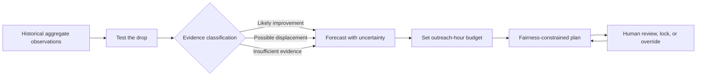

# Still Here SD

> **See beyond the count. Plan the next shift.**

A displacement-aware forecasting and outreach-planning tool for the 2026
Building for Good Hackathon in San Diego. It answers a question conventional
dashboards cannot:

> **When an unsheltered count falls, did conditions improve, did observed need
> shift beyond the count boundary, or is there not enough evidence to know?**

It tests an apparent decline, forecasts aggregate neighborhood observations
with uncertainty, and helps a human coordinator distribute limited outreach
hours without silently abandoning lower-visibility neighborhoods.

| | |
|---|---|
| **Challenge** | [Downtown Homelessness](https://luma.com/0d16go33) |
| **Primary user** | Outreach or community-services coordinator |
| **Decision** | Where should limited outreach capacity go next? |
| **Core interaction** | **Test the drop** → **Forecast** → **Plan next shift** |
| **Responsible-data promise** | Aggregate places, never profile people |
| **Status** | In development on five track branches; see [project control](docs/project/PROJECT_CONTROL.md) |

## Why this matters

A lower count is an observation, not automatically an outcome. Counts change
because people obtained housing, moved nearby, became less visible, or were
missed as weather, boundaries, or collection practices changed. Complaint
volume adds its own distortion: it reflects who reports, not who needs help.

Still Here SD refuses to collapse those realities into one confident number.
It supports three deliberately limited conclusions:

- **Likely improvement** — multiple comparable aggregate signals support a sustained decline.
- **Possible displacement** — a local decline coincides with nearby aggregate increases strongly enough to preserve outreach continuity.
- **Insufficient evidence** — missing, inconsistent, or methodologically incompatible data prevent a responsible conclusion.

These labels describe evidence about places and observations, never the
circumstances of any person.

## One connected decision pipeline



Not three separate dashboards: each step changes the next decision.

## Core experience

**1. Test the past.** Select a neighborhood and month, choose **Test the
drop**, and get a classification with the evidence for and against it.

<details>
<summary>What the test evaluates</summary>

- whether the observation period is complete and comparable;
- whether the change persists beyond one month;
- whether nearby aggregate observations rose as the selected area fell;
- whether independent sources agree or conflict;
- whether a known methodology or boundary change affects interpretation; and
- how much of the apparent change remains unmatched.

</details>

**2. Forecast the future.** Aggregate neighborhood observations, never
individual behavior. Candidates are backtested against a seasonal-naive
baseline; if nothing beats the baseline, the baseline ships, with prediction
intervals and error visible in the interface.

**3. Plan the next shift.** Enter a budget (for example 80 outreach hours).
The planner converts the upper forecast range, uncertainty and continuity
reserves, and travel burden into an allocation that respects the budget, a
visible minimum-coverage floor, and any human-locked assignments. The planning
load is not a count of people or a promise of impact.

**4. Keep the human in control.** Every allocation answers **Why this
amount?**; a coordinator can lock, override, and recompute, and the exported
plan records assumptions instead of hiding them behind a score. The tool
informs deliberation. It does not authorize outreach, enforcement,
displacement, or service eligibility.

## What makes this different

| Conventional dashboard | Still Here SD |
|---|---|
| Reports where counts rose or fell | Tests whether a decline is supported, displaced, or uncertain |
| Shows a trend line | Backtests the forecast and displays uncertainty |
| Treats all observations as comparable | Surfaces missing months and methodology breaks |
| Ranks areas by a single score | Explains multiple evidence signals and disagreements |
| Stops at description | Connects evidence to a constrained planning decision |
| Mentions fairness in documentation | Makes fairness a visible, testable allocation constraint |
| Encourages trust in the interface | Gives users reasons to question and override the result |

No generative model participates in classification, forecasting, or
allocation.

## Responsible Data Science as product behavior

The design follows the Data Science Alliance's [Guiding Principles of
Responsible Data
Science](https://www.datasciencealliance.org/assets/documents/white%20papers/Guiding%20Priniciples%20of%20Responsible%20Data%20Science.pdf).

| Principle | Product control | Visible proof |
|---|---|---|
| **Fairness** | Minimum neighborhood coverage; complaint volume excluded from the allocation target | Compare plans with and without the fairness guard |
| **Transparency** | Inspectable evidence, models, assumptions, objectives, and constraints | Open **Why this result?** from any classification or allocation |
| **Privacy** | Point observations aggregated before publication; no profiles or movement histories | Deployed-data check confirms precise coordinates are absent |
| **Veracity** | Baseline comparison, rolling backtests, uncertainty, missing-data warnings, limited language | Model and data cards travel with every exported plan |
| **Human oversight** | Lock, override, and recompute without concealing the change | Demonstrate a manual allocation during the pitch |

### Language boundaries

May say: "aggregate changes are consistent with possible displacement", "the
available evidence is insufficient", "this forecast has a wide uncertainty
interval."

May not say: "these people moved from A to B", "this policy caused the
decline", "this neighborhood needs enforcement", "this shelter has available
beds."

### Explicit non-goals

Not a service directory or chatbot, an individual risk model, a public map of
sleeping locations, an enforcement or encampment-clearing tool, an
aerial-surveillance product, a source of live shelter availability, a causal
policy-effect calculator, or an autonomous decision-maker.

## Run it

```bash
./scripts/verify.sh   # lint, type-check, test, and build everything
```

Setup, commands, and layout: [DEVELOPMENT.md](DEVELOPMENT.md). The target is a
static deployment — Python prepares versioned aggregate JSON, the React app
consumes it, and the demo needs no login, database, or live API.

## Documentation

| Document | Contents |
|---|---|
| [DEVELOPMENT_PLAN.md](DEVELOPMENT_PLAN.md) | Milestones, critical path, test strategy, MVP checklist |
| [DEVELOPMENT.md](DEVELOPMENT.md) | Setup, commands, repository layout |
| [docs/project/PROJECT_CONTROL.md](docs/project/PROJECT_CONTROL.md) | Ownership, decisions, risks, scope ledger, release readiness |
| [docs/project/DATA_STRATEGY.md](docs/project/DATA_STRATEGY.md) | Sources, guardrails, known data limitations |
| [docs/project/METHODS.md](docs/project/METHODS.md) | Drop-test, forecasting, and planner methods; fallback playbook |
| [docs/product/PREPARED_SCENARIO.md](docs/product/PREPARED_SCENARIO.md) | The prepared decision scenario |
| [docs/product/UI_STORYBOARD.md](docs/product/UI_STORYBOARD.md) | Decision-flow storyboard and interface states |
| [docs/product/DEMO_SCRIPT.md](docs/product/DEMO_SCRIPT.md) | Three-minute demo narrative |
| [config/decision.v1.json](config/decision.v1.json) | The versioned MVP decision contract |

## Fresh-code boundary and AI disclosure

This repository exists for the Building for Good Hackathon; before the hacking
window it held only empty infrastructure and planning documentation, and no
code, assets, data, or schemas are reused from On Record. Research and
planning were assisted by OpenAI Codex; AI used during implementation is
disclosed by product, purpose, and workflow, and its suggestions remain
subject to human review, testing, and responsibility. No LLM output determines
a drop classification, forecast, or outreach allocation.

## Working pitch

> Most dashboards show where homelessness was counted. Still Here SD asks
> whether an apparent improvement is supported, displaced, or simply
> uncertain; forecasts where outreach continuity may be needed next; and
> builds a transparent plan that refuses to hide who could be left behind.
