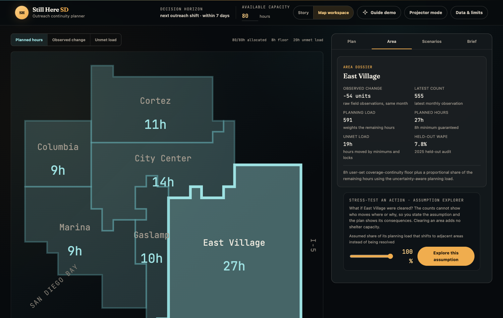

# Still Here SD

> **The estimate fell. Direct observations rose.** One headline can hide a
> measurement-composition shift.

**[Open the live demo →](https://dcondrey.github.io/buildingforgood/)** ·
works offline once loaded ·
[5-minute script](docs/product/DEMO_SCRIPT.md) ·
[judge Q&A](docs/product/JUDGE_QA.md)



Downtown San Diego's component-derived unsheltered estimate fell 22% in a
year on the fixed 261-block panel — but the drop came from tents, not people.
On those same blocks, direct observations of people rose 7.5% and appeared on
25 *more* blocks than the year before. Still Here SD audits that ruler before it
becomes a coverage policy: it decomposes the change, backtests a forecast
honestly, and turns the evidence into an editable, human-owned outreach plan
on a real map of the six downtown neighborhoods.

**No login. No live API. No person-level data. No LLM in the decision path.**

## The story in three beats

1. **Challenge the headline.** Run **Test the drop**: observed individuals
   rose while structures and the derived estimate fell.
2. **Make uncertainty operational.** Replay the January 2026 forecast using
   only information frozen at December 2025, graded against its own past
   errors.
3. **Plan under a visible policy.** Allocate 80 staff-hours with a user-set
   8-hour continuity floor; drag the what-if slider and watch the plan
   recompute live.
4. **Stress-test an action.** Model a hypothetical clearance under a stated
   displaced-share assumption — labeled assumed, never predicted.
5. **Keep the human accountable.** Lock and edit any assignment, then copy a
   decision brief that carries evidence, uncertainty, and every human change.

| Prepared output                | Reproducible result                                                                                 |
| ------------------------------ | --------------------------------------------------------------------------------------------------- |
| Component evidence             | Individuals +7.5%, on 25 more blocks; tents/structures −54.7%; derived estimate −22.3%              |
| Historical January 2026 replay | Point 882.5; 80% residual band 769.0–996.1; held-out audit MAE 62.8, WAPE 8.6%, coverage 75%        |
| 8-hour continuity scenario     | City Center 14 · Columbia 9 · Cortez 11 · East Village 27 · Gaslamp 10 · Marina 9 (of 80)           |

## Run it

```bash
npm ci --prefix app && npm --prefix app run dev -- --host 127.0.0.1
```

In the app, **Guide demo** gives a ten-step hands-on tour that asks you to
work the real controls and notices when you have. The **Map workspace**
toggle switches to an operations view: one map with switchable layers
(planned hours, observed change, unmet load) and a tabbed inspector holding
the plan controls, a per-area dossier with the assumption explorer, saved
scenarios, and the decision brief. The story view and the workspace share one
state — the same plan, locks, scenarios, and assumptions travel between them.

To regenerate the analysis artifact and run the full gate (Python 3.11+;
raw-data tests skip without the organizer bundle):

```bash
python3 -m venv .venv && .venv/bin/pip install -e "pipeline[dev]"
PYTHONPATH=pipeline/src .venv/bin/python -m stillhere_pipeline.demo
./scripts/verify.sh
```

The generated artifact is byte-reproducible; `verify.sh` runs both language
gates and a fail-closed privacy scan of the exact deployable bundle.

## What it will not say

The product analyzes observations of aggregate places, never profiles of
people. Four sentences it is designed to refuse:

- "These people moved from one block or neighborhood to another."
- "A policy caused the decline."
- "This area needs enforcement."
- "A shelter has capacity or someone is eligible for a service."

311 complaint volume is not a forecasting or planning input — it measures
reporting behavior, not need — and its diagnostic is shown precisely so that
exclusion can be audited. The refusal is stated narrowly on purpose:
**complaint volume cannot reach allocation without also corrupting the
published forecast interval, which is derived from checksummed inputs.** The
broader claim — that complaint volume cannot influence planning — was tested
by an independent review, falsified, and withdrawn
([`docs/project/DECISIONS.md`](docs/project/DECISIONS.md)).

## Go deeper

- [Technical overview](docs/project/TECHNICAL_OVERVIEW.md) — the full
  analytical narrative, architecture, failure-mode scorecard, data inventory,
  and independent-source audit
- [Judge Q&A](docs/product/JUDGE_QA.md) — direct answers, including the
  hostile ones
- [Data quality audit](docs/project/DATA_QUALITY_AUDIT.md) — cleaning gates,
  retained anomalies, gap provenance, reproducibility hashes
- [Demo script](docs/product/DEMO_SCRIPT.md) — the timed five-minute
  walkthrough and offline fallback plan
- [Small-cell suppression policy](docs/policy/small-cell-suppression.md) —
  the privacy attacker model
- Code: [`app/`](app/) is the static decision experience;
  [`pipeline/`](pipeline/) is the deterministic analysis;
  [`tests/`](tests/) holds the analytical contracts and privacy tests

## Project files

- [`LICENSE`](LICENSE) — Apache-2.0
- [`SECURITY.md`](SECURITY.md) — what a vulnerability means in a system with
  no backend, and how to report one
- [`CONTRIBUTING.md`](CONTRIBUTING.md) — the seven non-negotiable invariants
  and how to run the gates
- [`CHANGELOG.md`](CHANGELOG.md) — what changed, and the limitations recorded
  rather than papered over
- [`docs/project/DATA_GOVERNANCE.md`](docs/project/DATA_GOVERNANCE.md) — what
  data enters and at what grain, what an adopting organization must and must
  never supply, what the tool refuses to do with what it holds, and why
  retention is not a question that arises. Read this first if you are
  evaluating the tool for your own organization.

## The pitch

> Most dashboards tell us where homelessness was counted. Still Here SD asks
> whether a lower count survives a measurement audit, shows what remains
> uncertain, and turns that evidence into a transparent coverage-policy
> scenario that refuses to hide who might otherwise be left behind.
>
> **The estimate fell. Direct observations rose. Which ruler should govern a
> coverage policy?**

This repository exists for the Building for Good Hackathon; before the hacking
window it held only empty infrastructure and planning documentation, and no
code, assets, data, or schemas are reused from On Record. Research and
planning were assisted by OpenAI Codex; AI used during implementation is
disclosed by product, purpose, and workflow, and its suggestions remain
subject to human review, testing, and responsibility. No LLM output determines
a drop classification, forecast, or outreach allocation.

## License

Apache-2.0, copyright David Condrey. See [`LICENSE`](LICENSE) for the full
text, including the patent grant and the warranty disclaimer. The license
covers the code and documentation in this repository; it does not convey any
right to the source data, which stays under its own publishers' terms as
recorded in [`data/cards/source_ledger.yaml`](data/cards/source_ledger.yaml).
