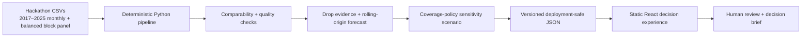

# Still Here SD

> **The estimate fell. Direct observations rose.** One headline can hide a
> measurement-composition shift.

Still Here SD is a measurement-aware forecasting and outreach-planning tool
built for the 2026 Building for Good Hackathon in San Diego. It helps a human
coordinator answer a deceptively difficult question:

> When an unsheltered estimate falls, which observed component produced the
> change, what remains uncertain, and how should a limited coverage policy be
> stress-tested before anyone acts on it?

The prepared analysis starts with a striking composition shift in the latest
same-month annual comparison available on the stable 261-block panel. Between
January 2024 and January 2025, people visually observed in the open rise from
**510 to 548** (**+7.5%**) and appear on **111 to 136 blocks**; the increase
survives a two-observed-individual threshold (**78 to 94 blocks**). At the same
time, tents/structures fall from **258 to 117** (**−54.7%**) and vehicles from
**10 to 5**.

Under the unchanged POST2020 multipliers, a secondary component-derived
estimate therefore falls from **981.8 to 762.9** (**−22.3%**): individuals
contribute **+38**, tents/structures **−246.8**, and vehicles **−10.2**. The
derived decline is structure-driven and partly offset by more direct visual
observations. Component values come from map digitization, not a census of
unique people, so this is a measurement decomposition—not proof of movement,
housing exits, or policy impact.

The need for a fixed ruler is measurable: from February 2021 to January 2023,
the expanded 382-block footprint suggests a **+191.2%** increase, while the
common 261-block panel shows **+95.8%**. Coverage expansion overstates the
change by **95.4 percentage points**. The panel does not solve every measurement
problem; it prevents that particular one from becoming a result.

A separate, allocation-excluded Get It Done diagnostic recovers the most useful
part of the original “two official systems disagree” idea. Comparing January–
June 2023 with August 2023–January 2024, all downtown Get It Done rows rose
**9.2%**, while Encampment rows rose **50.7%** and top-level requests rose
**54.8%**. Encampment share moved from **41.0% to 56.6%** even though Mobile
remained the dominant intake channel (**93.0% to 91.4%**). A matched-calendar
check comparing August–January one year apart is stronger still: Encampment rows
rise **88.1%**, top-level requests **96.0%**, and share **14.2 percentage
points**. This is a pre/post reporting-pattern shift—not a count of people or a
causal effect.

| From evidence to action        | What Still Here SD does                                                                                      |
| ------------------------------ | ------------------------------------------------------------------------------------------------------------ |
| **Test the composition**       | Separates like-for-like components on a comparable footprint and exposes missingness and method changes.     |
| **Replay a forecast honestly** | Runs a historical one-step-ahead scenario with chronological model selection, calibration, and audit splits. |
| **Audit a coverage policy**    | Compares 0-, 4-, and 8-hour continuity floors within an editable 80-hour scenario.                           |

**No login. No live API. No person-level model. No LLM makes a classification,
forecast, or allocation.**

## Run the live demo

Prerequisites: Node.js 20+ and npm.

```bash
npm ci --prefix app && npm --prefix app run dev -- --host 127.0.0.1
```

Open the local address printed by Vite, normally
[`http://127.0.0.1:5173`](http://127.0.0.1:5173). The app reads a versioned,
static analysis artifact and has no runtime network dependency.

The three-minute walkthrough is in
[`docs/product/DEMO_SCRIPT.md`](docs/product/DEMO_SCRIPT.md); concise technical
and ethics answers are in
[`docs/product/JUDGE_QA.md`](docs/product/JUDGE_QA.md).

Use **Guide demo** for a four-beat, keyboard-safe walkthrough with a deliberate
**Next** reveal, or drive the four decision scenes manually. The guide never
changes the underlying analysis; it stages the same local artifact.

## The three-minute story

1. **Challenge the headline.** Run **Test the drop** and reveal that observed
   individuals rose while structures and the derived adjusted estimate fell.
2. **Make uncertainty operational.** Replay the January 2026 one-step-ahead
   scenario using only information frozen at December 2025.
3. **Generate a continuity scenario.** Allocate 80 staff-hours under a visible,
   user-set 8-hour demo-policy floor.
4. **Expose the tradeoff.** Compare the 0-, 4-, and 8-hour policy settings, then
   lock and edit an assignment and recompute.
5. **Keep the human accountable.** Copy a decision brief that carries the
   evidence, assumptions, uncertainty, constraints, and human changes.

The planner's output is decision support for review. It does not dispatch
workers, establish service need, predict an individual's location, or authorize
enforcement.

| Prepared output                | Reproducible result                                                                                                                    |
| ------------------------------ | -------------------------------------------------------------------------------------------------------------------------------------- |
| Component evidence             | Observed individuals +7.5% and present on 25 more blocks; tents/structures −54.7%; derived adjusted estimate −22.3%                    |
| Reporting diagnostic           | Prepared windows: all GID +9.2%, Encampment +50.7%, top-level +54.8%; matched calendar: +40.9%, +88.1%, +96.0%; excluded from scenario |
| Historical January 2026 replay | Local linear: 882.5; 80% historical residual band 769.0–996.1; 2025 audit MAE 62.8, WAPE 8.6%, coverage 75%                            |
| 8-hour continuity scenario     | City Center 14; Columbia 9; Cortez 11; East Village 27; Gaslamp 10; Marina 9                                                           |

## Why this is data science, not another dashboard

The important model choice begins before forecasting. The supplied bundle
contains monthly published totals, derived components, changing multipliers,
changing count effort, and block snapshots with an expanding footprint. Still
Here SD encodes those measurement realities instead of smoothing them away.

- **Coverage counterfactual.** Longitudinal spatial comparisons ask what change
  remains when the observation footprint is held fixed: the 261 blocks present
  on all 12 block-count dates, not the later 382-block footprint. This isolates
  coverage composition; it is not a causal counterfactual.
- **Correct quantity.** The published `total` is already adjusted by tent and
  vehicle multipliers; it is never added to the component counts.
- **Honest missingness.** Null means not reported, not zero. Gaps are retained
  and skipped rather than imputed into artificial certainty.
- **Time-respecting evaluation.** Forecasts train on the stable POST2020 era
  and use rolling-origin backtests—never a random train/test split.
- **Complexity must earn its place.** A registered seasonal-naive baseline is
  challenged by a recent-three-observation mean and a local linear trend. A
  challenger is promoted only for strictly lower 2023 rolling-origin MAE; ties
  stay with the baseline. WAPE is reported as a second, scale-relative audit.
- **Uncertainty is backtested too.** Walk-forward residual, conformal-style
  intervals use only errors available before each target, and empirical
  coverage is reported beside nominal coverage rather than assumed.
- **Uncertainty changes the decision.** The planner uses an upper forecast
  bound as planning load, so uncertainty affects hours rather than appearing as
  decorative shading.
- **Policy is executable.** A fixed budget, non-negative whole-hour
  allocations, user-set 0-, 4-, and 8-hour continuity floors, and deterministic
  largest-remainder rounding are visible and testable. No floor is labeled
  learned, optimal, or fair by itself.
- **Reporting bias is tested, not fused away.** Get It Done is analyzed in a
  separate diagnostic lane with raw-versus-parent, intake-channel, overall-
  platform, and placebo-category checks. It never enters the forecast or
  planner.

### Architecture



The browser never receives the raw CSVs, block geometry, coordinates, street
labels, or record-level data. The application can therefore run from a local
production build with Wi-Fi disabled.

### Technical scorecard

| Failure mode                                              | Design control                                                      | Auditable evidence                                         |
| --------------------------------------------------------- | ------------------------------------------------------------------- | ---------------------------------------------------------- |
| Coverage expansion masquerades as growth                  | Common-support 261-block panel                                      | Prepared artifact reports panel membership and fixed dates |
| Future information leaks into model choice                | 2023 promotion holdout, 2024 interval calibration, 2025 final audit | Rolling-origin fold count, MAE, and WAPE                   |
| A weak candidate replaces a known baseline                | Explicit seasonal-naive promotion gate                              | Candidate scorecard and deterministic tie behavior         |
| Nominal uncertainty is assumed to be calibrated           | Prior-residual interval at each fold                                | Nominal 80% level beside empirical coverage                |
| Uncertainty is visually present but operationally ignored | Area upper bounds define planning load                              | Per-area load, floor, variable hours, and reason           |
| Policy or human changes break the budget                  | Constraint checks plus largest-remainder rounding                   | Exactly 80 whole hours, floor status, and preserved locks  |

## Data

The organizers supplied a curated bundle derived from Downtown San Diego
Partnership Clean & Safe monthly Unsheltered Sleep Count reports:

| Asset                            | Coverage                                                             | Responsible use                                                      |
| -------------------------------- | -------------------------------------------------------------------- | -------------------------------------------------------------------- |
| `DowntownCounts_Monthly.csv`     | 2,880 rows; 2017–2025 monthly area/component observations            | Published area totals, forecasting, methodology-aware context        |
| `BlockLevel_Counts_Panel261.csv` | 3,132 rows; 261 blocks common to 12 count dates                      | Like-for-like aggregate spatial change                               |
| `BlockLevel_Counts.csv`          | 3,737 rows; 382 blocks                                               | Cross-sectional QA only when footprints differ                       |
| `Area_Crosswalk.csv`             | 24 explicit label mappings                                           | Prevents East Village and Core/City Center join errors               |
| `Methodology_Periods.csv`        | Four documented method eras                                          | Keeps multiplier and cross-source changes visible                    |
| City Get It Done CD3 extract     | Daily City export; 48 monthly diagnostic rows retained for 2022–2025 | Reporting-process audit only; exact `DOWNTOWN` community-plan filter |

The analysis keeps three measurement lanes separate. Fixed-panel, separately
digitized **components** support the like-for-like composition evidence;
verified, multiplier-adjusted **published area totals** support the monthly
trend and historical forecast replay; Get It Done rows audit reporting
attention. Their levels are never equated or silently combined.

The supplied bundle is read locally from `data/raw/hackathon_provided/` and is
intentionally git-ignored; see [`data/raw/README.md`](data/raw/README.md). The
committed deployment-safe demo artifact is enough to run the interface.
Important limitations remain visible: visual street sweeps undercount; count
effort changed; block coverage expanded in 2022; some component digitizations
conflict with verified totals; and an aggregate pattern cannot distinguish
housing exits, movement, new arrivals, or measurement error.

### Independent sources and validation

- The [City Get It Done portal and dictionary](https://data.sandiego.gov/datasets/get-it-done-reports/)
  define parent links, `date_requested`, `case_origin`, status, and community-
  plan geography. Parent-linked children are workflow-related requests—not
  verified duplicate observations—and `case_origin` is a channel, not identity.
- The [April 2026 City Auditor report](https://www.sandiego.gov/sites/default/files/2026-04/performance-audit-of-the-city-s-response-to-homeless-encampments-since-the-unsafe-camping-ordinance.pdf)
  independently documents downtown count/report divergence and explicitly says
  the available data cannot determine geographic movement. Still Here adds the
  reproducible parent, channel, general-platform, and placebo sensitivity tests.
- The organizer bundle is derived from Downtown San Diego Partnership monthly
  reports, including the [June 2025 report](https://downtownsandiego.org/wp-content/uploads/2025/07/June-2025-Unsheltered-Sleep-Counts-With-Maps-1.pdf).
  Its May 2023, January 2024, and June 2025 checkpoints are compared with Get It
  Done only as a mismatched-construct bias diagnostic.
- A fixed 1,997-pole cohort from the [City parking-transactions portal](https://data.sandiego.gov/datasets/parking-meters-transactions-monthly/)
  supplies a matched-calendar foot-traffic sensitivity. Paid curb parking is
  incomplete exposure data and never enters the forecast or scenario.
- [NOAA daily summaries](https://www.ncei.noaa.gov/access/services/data/v1?dataset=daily-summaries&stations=USW00023188&startDate=2022-01-01&endDate=2025-12-31&format=csv&units=standard&includeAttributes=false)
  provide same-day airport weather for an observation-condition check only.
- HCAI's [Hospital Encounters for Homeless Patients](https://data.chhs.ca.gov/dataset/hospital-encounters-for-homeless-patients)
  provide a pooled 2023–2024 health-system burden snapshot: San Diego County
  facilities report 78,261 emergency visits and 28,024 inpatient
  hospitalizations tagged for patients experiencing homelessness. HCAI's
  [Primary Care Clinic Annual Utilization Data](https://hcai.ca.gov/data/healthcare-utilization/clinic-utilization/)
  also include final 2022–2024 filings for the exact St. Vincent de Paul Village
  Family Health Center. Both are context only—not unique-patient counts,
  downtown street-count validation, or planner inputs.
- Cal ICH's [CA System Performance Measures](https://data.ca.gov/dataset/ca-system-performance-measures-statewide-and-by-coc)
  (HDIS-derived, statewide and by CoC) quantify street outreach by outcomes,
  not staffing: San Diego CoC successful placements from street outreach
  (measure M6) rose from 2,929 in 2020 to 6,014 in 2025. Annual, countywide
  figures; context for the capacity discussion only—never a forecast or
  planner input.
- An [SSA administrative-data study](https://www.ssa.gov/policy/docs/ssb/v81n2/v81n2p1.html)
  provides methodological precedent for auditing operational indicators: text
  mining alone identified 20.1% of its 810,326 applicants classified as
  experiencing homelessness. Its 2007–2017 national disability-applicant frame
  is not a local validation series and does not enter our model.
- The [sandiegodata-projects DSDP repository](https://github.com/sandiegodata-projects/downtown-partnership)
  documents the public digitization and update lineage behind these count
  files. It supports provenance, not independent validation of the same maps.
- DSDP's pinned [June 2026 Unsheltered Sleep Count report](https://downtownsandiego.org/wp-content/uploads/2026/08/June-2026-Unsheltered-Sleep-Count.1.pdf)
  supplies post-freeze public checkpoints (six-area core totals of 959 in
  April and 841 in June 2026), transcribed in
  [`data/monitoring/dsdp_public_checkpoints.csv`](data/monitoring/dsdp_public_checkpoints.csv).
  Same publisher as the organizer bundle, monitoring lane only—never a model
  input—and with no January–March 2026 observation it cannot validate the
  January 2026 forecast replay.

| Conventional dashboard                | Still Here SD                                                                                               |
| ------------------------------------- | ----------------------------------------------------------------------------------------------------------- |
| Reports where counts rose or fell     | Tests whether an apparent decline is supported, coincides with nearby aggregate increases, or is unresolved |
| Shows a trend line                    | Backtests the forecast and displays uncertainty                                                             |
| Treats all observations as comparable | Surfaces missing months and methodology breaks                                                              |
| Ranks areas by a single score         | Explains multiple evidence signals and disagreements                                                        |
| Stops at description                  | Connects evidence to a constrained planning decision                                                        |
| Mentions fairness in documentation    | Makes fairness a visible, testable allocation constraint                                                    |
| Encourages trust in the interface     | Gives users reasons to question and override the result                                                     |

## Responsible-use boundary

Still Here SD analyzes **observations of aggregate places, never profiles of
people**.

| Responsible-data principle | Executable product behavior                                                                                                  |
| -------------------------- | ---------------------------------------------------------------------------------------------------------------------------- |
| **Policy accountability**  | 0-, 4-, and 8-hour continuity sensitivities, infeasibility response, and guarded-versus-unguarded audit                      |
| **Transparency**           | Model scorecard, empirical coverage, allocation reasons, source hashes, and decision brief                                   |
| **Privacy**                | No raw rows, block identifiers, geometry, coordinates, street labels, or small per-area component cells in the demo artifact |
| **Veracity**               | Nulls stay missing; method and footprint breaks remain explicit; a challenger must earn baseline promotion                   |
| **Human oversight**        | Editable budget, locks, explicit recompute, review triggers, and no automatic dispatch                                       |

It may say:

- "Observed individuals increased while structures decreased on the same blocks."
- "The available evidence is insufficient."
- "The historical residual band is wide, so the scenario tests more continuity."

It may not say:

- "These people moved from one block or neighborhood to another."
- "A policy caused the decline."
- "This area needs enforcement."
- "A shelter has capacity or someone is eligible for a service."

Complaint or 311 volume is intentionally excluded from forecasting and planning
load: it measures reporting behavior, not people or need. Its aggregate
diagnostic is visible precisely so judges can audit that boundary. Small counts
and precise locations do not ship. A human can question, edit, lock, or reject
every plan.

Generative AI assisted research, implementation, testing, and documentation
during the hackathon. Runtime evidence, forecasting, and allocation are
deterministic code over versioned inputs; no model-generated judgment enters
the decision path.

## Reproduce and verify

Python 3.11+ is required for the analytical pipeline.

To regenerate the demo artifact, first place the organizer-supplied CSV bundle
in `data/raw/hackathon_provided/`. Running the app or the full test suite does
not require those ignored raw files; raw-dependent tests skip when the bundle
is unavailable.

```bash
python3 -m venv .venv
.venv/bin/pip install -e "pipeline[dev]"
PYTHONPATH=pipeline/src .venv/bin/python -m stillhere_pipeline.demo
./scripts/verify.sh
```

`./scripts/verify.sh` checks Python formatting, lint, types, and tests, then
frontend formatting, lint, tests, and the static production build. Generated
files are deterministic for the same versioned inputs.

## Repository guide

| Path                                                                                 | Purpose                                                                                            |
| ------------------------------------------------------------------------------------ | -------------------------------------------------------------------------------------------------- |
| [`app/`](app/)                                                                       | React, Vite, and TypeScript decision experience                                                    |
| [`pipeline/`](pipeline/)                                                             | Deterministic preparation, analysis, forecasting, privacy, and planning code                       |
| [`pipeline/src/stillhere_pipeline/demo.py`](pipeline/src/stillhere_pipeline/demo.py) | Authoritative two-ruler analysis, chronological model selection, interval, and prepared plan build |
| [`public/generated/demo.v1.json`](public/generated/demo.v1.json)                     | Versioned deployment-safe artifact consumed by the live experience                                 |
| [`tests/`](tests/)                                                                   | Analytical contracts, edge cases, invariants, and privacy tests                                    |
| [`docs/product/DEMO_SCRIPT.md`](docs/product/DEMO_SCRIPT.md)                         | Timed presentation, operator cues, and offline fallback                                            |
| [`docs/product/JUDGE_QA.md`](docs/product/JUDGE_QA.md)                               | Concise answers and hostile expert review questions                                                |
| [`docs/project/DATA_QUALITY_AUDIT.md`](docs/project/DATA_QUALITY_AUDIT.md)           | Cleaning gates, retained source flags, augmentation decisions, and reproducibility                 |
| [`docs/policy/small-cell-suppression.md`](docs/policy/small-cell-suppression.md)     | Suppression policy and attacker model                                                              |

## The pitch

> Most dashboards tell us where homelessness was counted. Still Here SD asks
> whether a lower count survives a measurement audit, shows what remains
> uncertain, and turns that evidence into a transparent coverage-policy
> scenario that
> refuses to hide who might otherwise be left behind.
>
> **The estimate fell. Direct observations rose. Which ruler should govern a
> coverage policy?**

This repository exists for the Building for Good Hackathon; before the hacking
window it held only empty infrastructure and planning documentation, and no
code, assets, data, or schemas are reused from On Record. Research and
planning were assisted by OpenAI Codex; AI used during implementation is
disclosed by product, purpose, and workflow, and its suggestions remain
subject to human review, testing, and responsibility. No LLM output determines
a drop classification, forecast, or outreach allocation.
