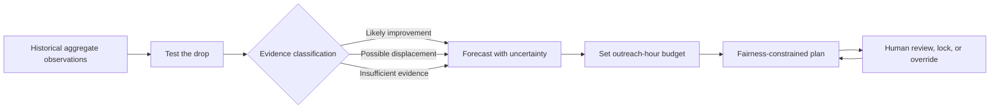

# Still Here SD

> **See beyond the count. Plan the next shift.**

Still Here SD is a displacement-aware forecasting and outreach-planning tool for the 2026 Building for Good Hackathon in San Diego. It asks a question that conventional dashboards cannot answer:

> **When an unsheltered count falls, did conditions improve, did observed need shift beyond the count boundary, or is there not enough evidence to know?**

The product turns that diagnosis into action. It tests an apparent decline, forecasts aggregate neighborhood-level observations with uncertainty, and helps a human coordinator distribute limited outreach hours without silently abandoning lower-visibility neighborhoods.

## At a glance

| | |
|---|---|
| **Challenge** | Downtown Homelessness |
| **Primary user** | Outreach or community-services coordinator |
| **Decision** | Where should limited outreach capacity go next? |
| **Core interaction** | **Test the drop** → **Forecast** → **Plan next shift** |
| **Responsible-data promise** | Aggregate places, never profile people |
| **Status** | Pre-build planning; implementation has not started |

Challenge brief: [Building for Good Hackathon](https://luma.com/0d16go33)

## Why this matters

A lower count is an observation, not automatically an outcome.

Monthly counts can change because people obtained housing, moved nearby, became less visible, or were missed as weather, boundaries, or collection practices changed. Complaint volume introduces another distortion: it reflects who reports, where housed residents live, enforcement attention, and access to reporting tools—not simply the number or needs of unhoused people.

Still Here SD refuses to collapse those realities into one confident number. It supports three deliberately limited conclusions:

- **Likely improvement** — multiple comparable aggregate signals support a sustained decline.
- **Possible displacement** — a local decline coincides with nearby aggregate increases strongly enough to preserve outreach continuity.
- **Insufficient evidence** — missing, inconsistent, or methodologically incompatible data prevent a responsible conclusion.

These labels describe evidence about places and observations. They do not claim to identify, track, or explain the circumstances of any person.

## One connected decision pipeline



The product is not three separate dashboards. Each step changes the next decision.

## Core experience

### 1. Test the past

A coordinator selects a neighborhood and month, then chooses **Test the drop**. The application evaluates:

- whether the observation period is complete and comparable;
- whether the change persists beyond one month;
- whether nearby aggregate observations rose as the selected area fell;
- whether independent sources agree or conflict;
- whether a known methodology or boundary change affects interpretation; and
- how much of the apparent change remains unmatched.

The result includes a classification, an evidence summary, and a visible list of reasons for and against that conclusion.

### 2. Forecast the future

Still Here SD forecasts aggregate neighborhood observations, not individual behavior. It:

- compares a seasonal-naive baseline with a small set of explainable candidates;
- evaluates models with rolling-origin backtests;
- selects complexity only when it improves held-out performance;
- presents prediction intervals rather than a single authoritative line; and
- exposes missingness, backtest error, and model choice in the interface.

If no candidate beats the baseline, the baseline ships.

### 3. Plan the next shift

The coordinator enters a budget such as 80 outreach hours. The planner converts the forecast into a relative planning load using:

- the upper forecast range;
- an uncertainty reserve;
- a continuity reserve for areas showing possible displacement;
- travel burden; and
- a visible minimum-coverage rule.

It then allocates hours while respecting the total budget, fairness floor, and any human-locked assignments. This planning load is not a count of people requesting service and is not a promise of operational impact.

### 4. Keep the human in control

Every suggested allocation answers **Why this amount?** A coordinator can lock an assignment, override it, and recompute the remainder. The system records assumptions in the exported plan instead of hiding them behind an optimization score.

Still Here SD informs deliberation. It does not authorize outreach, enforcement, displacement, or service eligibility.

## What makes this different

| Conventional dashboard | Still Here SD |
|---|---|
| Reports where counts rose or fell | Tests whether an apparent decline is supported, coincides with nearby aggregate increases, or is unresolved |
| Shows a trend line | Backtests the forecast and displays uncertainty |
| Treats all observations as comparable | Surfaces missing months and methodology breaks |
| Ranks areas by a single score | Explains multiple evidence signals and disagreements |
| Stops at description | Connects evidence to a constrained planning decision |
| Mentions fairness in documentation | Makes fairness a visible, testable allocation constraint |
| Encourages trust in the interface | Gives users reasons to question and override the result |

No generative model participates in classification, forecasting, or allocation.

## Three-minute demo

The demo follows one prepared, reproducible scenario.

1. **0:00 — The apparent success.** Open on a neighborhood with a visible decline: “The count fell here. Is that enough to call this progress?”
2. **0:25 — Test the drop.** Select the period and reveal the evidence classification, nearby aggregate change, missingness, and source agreement.
3. **0:55 — Show what remains uncertain.** Explain that the flow is consistent with redistribution but does not track people or prove causality.
4. **1:25 — Forecast forward.** Reveal the selected model, baseline comparison, and prediction interval.
5. **1:55 — Plan next shift.** Enter the available outreach hours and generate an allocation.
6. **2:20 — Make fairness tangible.** Compare the result with the coverage guard disabled, then restore it.
7. **2:40 — Keep humans accountable.** Lock one assignment, rerun the plan, and open the explanation/data-card panel.
8. **2:55 — Close.** “See beyond the count. Plan the next shift.”

## Responsible Data Science as product behavior

The design follows the Data Science Alliance’s [Guiding Principles of Responsible Data Science](https://www.datasciencealliance.org/assets/documents/white%20papers/Guiding%20Priniciples%20of%20Responsible%20Data%20Science.pdf).

| Principle | Product control | Visible proof |
|---|---|---|
| **Fairness** | Minimum neighborhood coverage; complaint volume excluded from the allocation target | Compare plans with and without the fairness guard |
| **Transparency** | Inspectable evidence, models, assumptions, objectives, and constraints | Open **Why this result?** from any classification or allocation |
| **Privacy** | Point observations aggregated before publication; no profiles or movement histories | Deployed-data check confirms that precise coordinates are absent |
| **Veracity** | Baseline comparison, rolling backtests, uncertainty, missing-data warnings, and limited language | Model and data cards travel with every exported plan |
| **Human oversight** | Lock, override, and recompute without concealing the change | Demonstrate a manual allocation during the pitch |

### Language boundaries

The application may say:

- “aggregate changes are consistent with possible displacement”;
- “the available evidence is insufficient”; or
- “this forecast has a wide uncertainty interval.”

It may not say:

- “these people moved from A to B”;
- “this policy caused the decline”;
- “this neighborhood needs enforcement”; or
- “this shelter has available beds.”

## Data strategy

The preferred source is the [SDHEART OpenData collection](https://sdheart.sdsu.edu/), cataloged by the [2025 Big Data Hackathon for San Diego](https://bigdataforsandiego.github.io/#dataset).

| Candidate source | Intended use | Guardrail |
|---|---|---|
| Downtown monthly survey observations | Historical neighborhood aggregation, drop testing, and forecasting | Remove exact coordinates from every published artifact |
| PIT Count density | Annual context and source comparison | Do not interpolate an annual snapshot into invented monthly precision |
| 311 encampment reports | Reporting-bias and disagreement diagnostic | Never treat complaints as people, need, or an allocation target |
| Shelter locations | Geographic context and travel estimates | Never imply live capacity, eligibility, or availability |
| Neighborhood ACS indicators | Aggregate context and fairness audit | Never infer an individual’s identity, condition, or service need |
| San Diego/SANDAG geography | Neighborhood boundaries and travel approximation | Publish only the geography required for the interface |

The [San Diego Regional Data Library Downtown Homelessness package](https://data.sandiegodata.org/dataset/sandiegodata-org-downtown-homeless-source/) is the machine-readable fallback for historical downtown counts. Official context may come from the [City of San Diego Homelessness Data & Reports](https://www.sandiego.gov/homelessness-strategies-and-solutions/data-reports) page and the Regional Task Force on Homelessness.

### Known limitations that must remain visible

- Several historical months are missing or excluded.
- Day-of-month values are unreliable for many records.
- Handwritten totals sometimes disagree with the sum of map annotations.
- Neighborhood names and boundaries are not perfectly consistent over time.
- Occupancy-multiplier practices create a comparability break after March 2017 in the fallback package.
- Weather and temperature fields contain missing values.
- PIT, monthly counts, 311 reports, and shelter information measure different phenomena.
- An aggregate flow model cannot distinguish housing exits, movement, new arrivals, or measurement error without additional evidence.

A source is not added merely because it is available. Its collection method, time scale, limitations, and permitted use must be explainable.

## Planned analytical approach

### Reproducible preparation

1. Preserve raw public files with source URLs and retrieval timestamps.
2. Validate dates, nonnegative counts, duplicate observations, and neighborhood labels.
3. Reconcile documented naming variants without silently changing boundaries.
4. Aggregate source points to the minimum geography needed for analysis.
5. Generate a machine-readable quality report.
6. Publish only aggregate analysis artifacts to the web application.

### Drop testing

The first implementation should remain interpretable:

- detect sustained local changes rather than reacting to one noisy month;
- compare decreases with nearby increases;
- use a small minimum-cost flow model to describe aggregate redistribution patterns;
- allow unmatched mass so every decline is not forced to appear somewhere else;
- reduce confidence when coverage is missing or methods are incomparable; and
- show the evidence components rather than fabricating a precise probability.

If the flow model is unstable, the product falls back to transparent adjacency deltas and labels the result insufficient rather than dressing uncertainty as sophistication.

### Forecasting

Candidate models:

- seasonal-naive baseline;
- exponential smoothing; and
- regularized lag-based regression.

Evaluation:

- rolling-origin time splits;
- mean absolute error and interval coverage;
- comparison by neighborhood and overall;
- no random train/test split for time-series data; and
- no claim of improvement unless held-out results beat the baseline.

Uncertainty intervals may use conformal residuals or residual bootstrap, depending on data volume and calibration.

### Outreach planning

The planner minimizes undercoverage and avoidable travel subject to:

- a fixed outreach-hour budget;
- a minimum coverage floor;
- nonnegative allocations;
- optional human-locked assignments; and
- a deterministic, inspectable objective.

A robust plan should use an upper forecast range or uncertainty reserve so uncertainty affects the decision rather than appearing as decorative shading.

## Planned architecture

```text
stillhere/
├── app/                    React + Vite + TypeScript interface
├── pipeline/               validation, aggregation, models, evaluation
├── data/
│   ├── raw/                immutable downloads; not published
│   ├── processed/          aggregate analysis tables
│   └── cards/              source and quality metadata
├── public/generated/       safe aggregate artifacts consumed by the app
├── tests/                  pipeline, model, planner, privacy, and UI checks
└── README.md
```

The target is a static deployment:

- Python prepares and evaluates data.
- Generated aggregate JSON feeds the browser.
- TypeScript runs presentation and lightweight scenario interactions.
- No login, production database, personal-data store, or fragile live API is required for the demo.

## Quality gates

### Data

- The application build fails if published artifacts contain precise-location fields.
- Missing months and methodology changes remain machine-readable.
- Every published metric has a source and retrieval date.
- Raw and processed data are never confused in the interface.

### Models

- Forecast evaluation contains no temporal leakage.
- Prediction intervals are ordered and finite.
- A candidate cannot replace the baseline without held-out improvement.
- Drop classifications expose their evidence components and limitations.

### Planner

- Allocated hours equal the available budget.
- No allocation is negative.
- The configured fairness floor is satisfied or the plan is declared infeasible.
- Human locks are preserved.
- 311 volume never enters the demand objective.

### Interface

- All essential interactions work with a keyboard.
- Meaning is not conveyed by color alone.
- Reduced-motion behavior is available.
- The presentation still works if animation is disabled.
- Every consequential result has an adjacent explanation.

## Definition of MVP

The project is demo-ready only when a judge can:

- select one neighborhood-period example;
- run **Test the drop** and inspect its evidence;
- see a backtested forecast with uncertainty;
- enter an outreach-hour budget;
- run **Plan next shift**;
- compare fairness-constrained and unconstrained plans;
- override one assignment;
- inspect data, model, limitation, and AI-disclosure cards; and
- reproduce the same prepared scenario without a network dependency.

One complete decision story is more valuable than ten disconnected charts.

## Scope control

### Must ship

- Aggregate downtown history.
- One clear map or spatial view.
- Drop testing with limited conclusions.
- Forecast with baseline comparison and uncertainty.
- Outreach-hours planner with fairness guard.
- Plain-language explanations and responsible-data cards.
- Focused automated tests.

### Ship only if the MVP is stable

- Animated aggregate flows.
- Additional independent sources.
- Locked allocations and scenario comparison.
- Printable planning brief.
- Presentation mode.

### Explicit non-goals

Still Here SD is not:

- a service directory or chatbot;
- an individual homelessness-risk model;
- a public map of sleeping locations;
- a police, citation, or encampment-clearing tool;
- an aerial-surveillance product;
- a source of live shelter availability;
- a causal policy-effect calculator; or
- an autonomous decision-maker.

## Build sequence

### Day 1: prove the decision

- **6:00–6:45 PM:** initialize the fresh project, source ledger, schemas, and test harness.
- **6:45–7:45 PM:** ingest, validate, normalize, and aggregate the primary dataset.
- **7:45–8:45 PM:** implement the seasonal baseline, rolling backtest, and intervals.
- **8:45–9:30 PM:** implement the first drop test and evidence explanation.
- **9:30–10:00 PM:** render the end-to-end vertical slice in a basic interface.

### Day 2: make it legible and reliable

- **8:30–9:30 AM:** implement the outreach planner and fairness constraint.
- **9:30–10:30 AM:** complete the spatial view and prepared demo scenario.
- **10:30–11:15 AM:** add data/model cards, overrides, and AI disclosure.
- **11:15 AM–12:00 PM:** accessibility, privacy, and planner tests.
- **12:00–12:45 PM:** visual polish and static deployment.
- **12:45–1:20 PM:** freeze features and rehearse.
- **1:20–1:45 PM:** record fallback demo media and prepare Q&A.
- **1:45 PM:** stop coding.

## Risk controls and fallbacks

| Risk | Response |
|---|---|
| SDHEART files are slow or inaccessible | Use the documented SDRDL CSV package |
| Neighborhood history is too sparse | Reduce geography or forecast the aggregate total honestly |
| Complex model does not beat baseline | Ship the seasonal baseline |
| Spatial flow is unstable | Use adjacent aggregate deltas and return **insufficient evidence** |
| Shelter data lacks capacity | Allocate outreach hours only |
| Map implementation consumes too much time | Use a simplified SVG spatial view |
| Animation threatens accessibility or reliability | Disable it; preserve the evidence table |
| A claim cannot be supported | Remove or narrow the claim |

## Fresh-code boundary and AI disclosure

This repository exists for the Building for Good Hackathon. The remote repository and local checkout existed before the hacking window only as empty infrastructure and planning documentation.

- No implementation code, design assets, datasets, schemas, or interaction code from On Record will be copied or reused.
- Implementation begins during the official hacking window.
- Research and planning were assisted by OpenAI Codex.
- Any AI used during implementation will be disclosed by product, purpose, and workflow.
- AI-generated suggestions remain subject to human review, testing, and responsibility.
- No LLM output will determine a drop classification, forecast, or outreach allocation.

## Working pitch

> Most dashboards show where homelessness was counted. Still Here SD asks whether an apparent improvement is supported by comparable evidence, coincides with nearby aggregate increases, or is simply uncertain; forecasts where outreach continuity may be needed next; and builds a transparent plan that refuses to hide what it cannot cover.

## Status

**Pre-build planning only. Implementation has not started.**
