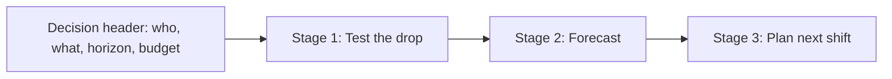

# Decision-flow storyboard and content inventory (B-01, #20)

Low-fidelity storyboard for **Test the drop → Forecast → Plan next shift**, with a
content inventory, state designs, accessibility annotations, and the technical
handoff map to #12, #13, and #15.

Inputs: README, DEVELOPMENT_PLAN.md, the #2 scenario proposal (discussion #40),
and the real generated-artifact shapes from the #6 pipeline
(`observations.v0.json`, `quality_report.v0.json`): 10 canonical neighborhoods,
monthly grain 2014-01 to 2022-12, five missing months (2014-08, 2014-09,
2015-06, 2018-11, 2019-12), and five machine-readable comparability events.

Rules this design commits to up front:

- **No precise-location visual, ever.** Neighborhood aggregates only; no dots on
  streets, no movement arrows between points, no individual-level anything.
- **No individual-movement narrative.** Displacement is shown as aggregate area
  change, phrased in the three approved labels only.
- Every consequential result has a **Why?** disclosure adjacent to it.
- Meaning is never carried by color alone; every state has an icon + text cue.

## 1. One screen, three stages

The app is a single decision surface with a persistent decision header and three
stages the coordinator moves through in order. Stages never hide earlier
context; the page accretes downward.



## 2. Storyboard (low-fi wireframes)

### Screen A: Decision header (always visible, above everything)

```
+----------------------------------------------------------------------+
| STILL HERE SD                                                        |
| Decision: Where do the coordinator's limited outreach hours go       |
|           next month?                                                |
| Horizon: OCTOBER 2022 (next month)   Budget: [ 200 ] hours  (edit)   |
| Scenario status: PLACEHOLDER badge until #2 locks                    |
+----------------------------------------------------------------------+
```

The decision, horizon, and budget are readable before any chart exists
(acceptance criterion 1). Budget is an editable input; editing it re-runs only
Stage 3.

### Screen B: Stage 1, Test the drop

```
+-- Test the drop -----------------------------------------------------+
| Neighborhood: [ east_village v ]   Month: [ 2022-09 v ]              |
| [ Test the drop ]                                                    |
|                                                                      |
| VERDICT CARD (after run)                                             |
| +------------------------------------------------------------------+ |
| | (i) POSSIBLE DISPLACEMENT                          [ Why? v ]    | |
| | Evidence for: local decline 2 consecutive months (-18%);         | |
| |   adjacent aggregate rise covers 62% of the local decline        | |
| | Evidence against: 1 adjacent neighborhood unusable this window   | |
| | Method flags in window: none                                     | |
| +------------------------------------------------------------------+ |
+----------------------------------------------------------------------+
```

The verdict card always shows BOTH columns (for and against), even when one is
empty ("No evidence against met the bar"), so the balance is visible and honest.

### Screen C: Observations panel (supports Stage 1; #13 extends spatially)

```
+-- Observed history: east_village ------------------------------------+
| [monthly bar/line chart 2014-01 .. 2022-12]                          |
|   ||||||||||  ||||| ▒ |||||||| ▒ ||||||||||||||||| ▒ ||||||||||     |
|                                                                      |
| Legend: | observed   ▒ no count that month (5 months)                |
| Flag markers on the time axis:                                       |
|   [M] 2017-04 multiplier era note   [B] 2017-04 east_village_south   |
|   split   [E] 2021-05 coverage expansion                             |
| (chart) OBSERVATIONS are counts of observed sleeping locations,      |
| aggregated by neighborhood and month. Not people totals.             |
+----------------------------------------------------------------------+
```

Missing months render as an explicit hatched band with an axis mark, never as a
zero. Method/boundary flags come straight from `comparability_events` in the
artifact and open their description on click/focus.

### Screen D: Stage 2, Forecast

```
+-- Forecast: east_village, OCTOBER 2022 ------------------------------+
| [chart: history tail + forecast point with interval band]            |
|                                                                      |
| Central estimate: 214    Interval: 168 to 261 (80%)   [ Why? v ]     |
| Model: seasonal-naive baseline                                       |
|   Baseline chosen: no candidate beat it on rolling backtest          |
|   Backtest error (MAE, last 12 origins): 23.4                       |
| (!) WIDE INTERVAL: interval spans more than 40% of the estimate      |
+----------------------------------------------------------------------+
```

The model line always names what was chosen AND why; "baseline ships unless a
candidate beats it" is a product promise made visible here.

### Screen E: Stage 3, Plan next shift (shell in #12; completed by #14/#15)

```
+-- Plan next shift ---------------------------------------------------+
| Budget: 200.0 h   Floors: 5% per eligible neighborhood   [ Why? v ]  |
| +--------------------------+--------+--------+                       |
| | neighborhood             | hours  | state  |                       |
| | east_village             |  46.0  | (lock) |                       |
| | east_village_south       |  31.5  |        |                       |
| | city_center              |  22.0  |        |                       |
| | ...                      |  ...   |        |                       |
| +--------------------------+--------+--------+                       |
| PLANNING LOAD is a derived planning weight, not a forecast and not   |
| an observation. 311 volume is never part of it.                      |
+----------------------------------------------------------------------+
```

## 3. Content inventory (per screen)

| Screen | Headings | Controls | Evidence elements | Warnings | Explanations | Empty/error states |
|---|---|---|---|---|---|---|
| A Header | product name; decision sentence | budget input; scenario picker (future) | horizon, budget values | placeholder badge when #2 unlocked | tooltip: where the scenario comes from | missing artifact: full-page "cannot load scenario" with retry |
| B Drop test | "Test the drop" | neighborhood select; month select; run button | verdict label; for/against lists; method flags in window | unusable-window warning; adjacent-unusable warning | Why? on verdict (thresholds, window, adjacency used) | untested state (before first run); insufficient-evidence verdict card |
| C Observations | "Observed history" | none (hover/focus tooltips) | monthly series; missing-month bands; event flags | missing months count; method flags | chart-adjacent definition of "observation" | no data for selection (should not occur with v0 artifact; still designed) |
| D Forecast | "Forecast" | none in #12 (horizon fixed) | interval band; central estimate; model name; backtest error; baseline comparison | wide-interval warning; short-history fallback warning | Why? on model choice (backtest table summary) | forecast unavailable (insufficient usable history) |
| E Planner | "Plan next shift" | budget input (shared with A); lock toggles; override entry (#15) | allocation table; floor indicator; uncovered load | infeasibility banner with exact shortfall | Why? on each allocation (floor, load, locks) | infeasible plan; zero-eligible state |

## 4. Visual hierarchy

1. **Decision header** (what is being decided, when, with what budget).
2. **Current verdict / recommended action** (verdict card, then allocation
   table once Stage 3 runs): the action-bearing elements sit above their
   supporting charts at every stage.
3. **Supporting evidence** (observed history, forecast band, backtest detail).
4. **Provenance and definitions** (source, retrieval date, term definitions):
   persistent footer, one click from everything.

Observations, forecasts, and planning load are three visually distinct
concepts: observations use solid marks and the word "observed"; forecasts use
an interval band and the word "estimate"; planning load appears only inside
the planner table with its own definition line. The three words never
substitute for each other anywhere in the UI.

## 5. State designs (required by #20)

| State | Trigger (from artifacts) | Presentation | Non-color cue |
|---|---|---|---|
| Wide uncertainty | interval width > 40% of central estimate (initial, tunable) | interval band stays; add "(!) WIDE INTERVAL" line under the estimate; Why? explains sample size and backtest error | (!) icon + the words "wide interval" |
| Missing data | any of the 5 missing months in the visible window | hatched band on the chart at that month; count in legend ("5 months have no count") | hatch pattern + axis mark + legend text |
| Insufficient evidence | verdict = insufficient_evidence | verdict card with (?) icon; the missing precondition listed first ("2018-11 has no count, so the window cannot be tested"); no action recommendation shown | (?) icon + explicit precondition sentence |
| Infeasible budget | floors + locks exceed budget | banner above allocation table: "This plan needs 212.0 h; budget is 200.0 h (short 12.0 h)"; table shows floors-only column; requires explicit override to proceed | banner icon + numeric shortfall in text |
| Human override | coordinator overrides floor or verdict | overridden rows get an "OVERRIDDEN" text chip and appear in the exported brief's change list | text chip, not a color highlight |
| Method flag in window | comparability_events month inside the tested window | flag marker on chart axis + a line in the verdict card's against column | lettered marker [M]/[B]/[E] + text |

## 6. Accessibility annotations

Keyboard reachable (tab order): budget input → neighborhood select → month
select → run button → verdict Why? → each chart flag marker → forecast Why? →
each lock toggle → override entry → export. Charts expose their data as an
adjacent table toggle ("View as table") so no information lives only in SVG.

Non-color cues are listed per state above; in addition, the three verdict
labels each carry a distinct icon shape ((^) improvement, (~) displacement,
(?) insufficient) and are always written out in words.

Focus visible at all times; all interactive elements are native buttons,
selects, and inputs (no div-click handlers), which the bootstrap's component
choices already support.

## 7. Technical handoff map (acceptance criterion 5)

| Element | Lands in |
|---|---|
| Decision header, stage layout, verdict card, drop-test interaction, forecast panel, Why? disclosures, state designs for wide/missing/insufficient | **#12** |
| Aggregate spatial view (neighborhood chips/mini-map at the AGGREGATE level only), uncertainty presentation on spatial elements, missing-data presentation spatially | **#13** |
| Responsible-data cards, definitions footer, approved-language enforcement in copy, accessibility audit against section 6, "View as table" chart alternatives | **#15** |
| Allocation table completion, locks, overrides, infeasibility banner behavior | **#14 (Track C) with #15 copy** |

## 8. Unresolved questions (owner: Dan unless noted)

1. Interval level for the forecast band (80% proposed here; #2/#40 decision).
2. Wide-interval threshold (40% is an initial guess; calibrate on backtests).
3. Whether Stage 3 renders at all before #14 lands or shows a "planner arrives
   in M4" placeholder (proposed: placeholder, so the flow shape is honest).
4. Mini-map vs neighborhood chip grid for #13 (chips are safer for the
   no-precise-location rule; David's call if a map base layer is wanted).

## 9. Review record

- Drafted by Dan's session 2026-08-20 from the inputs above.
- Adversarial review: pending (recorded here when run; see PR).
